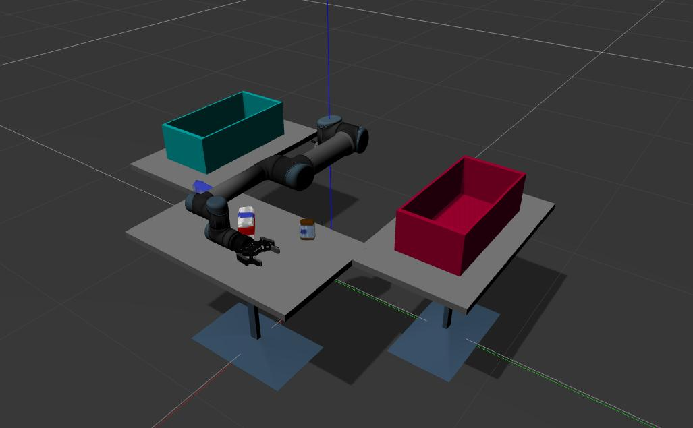

- **Modify the original code repository to adapt to the UR5 robot**
# Universal robot with robotiq hand workspace

## Build

```
source /opt/ros/kinetic/setup.bash
cd ur_ws/
sudo rosdep init
rosdep update
rosdep install --from-paths src --ignore-src --rosdistro kinetic -y
catkin build
```
* **if rosdep init & rosdep update failed,please visit [ROS -sudo rosdep init 失败解决方法](https://blog.csdn.net/bornfree5511/article/details/106267533)**

## Run

```
source ~/ur_ws/devel/setup.bash
roslaunch ur_platform_gazebo ur_platform_gazebo.launch
```


## Grasp

The other terminal

```
rosrun ur_platform_manipulation grasp_object.py
```


